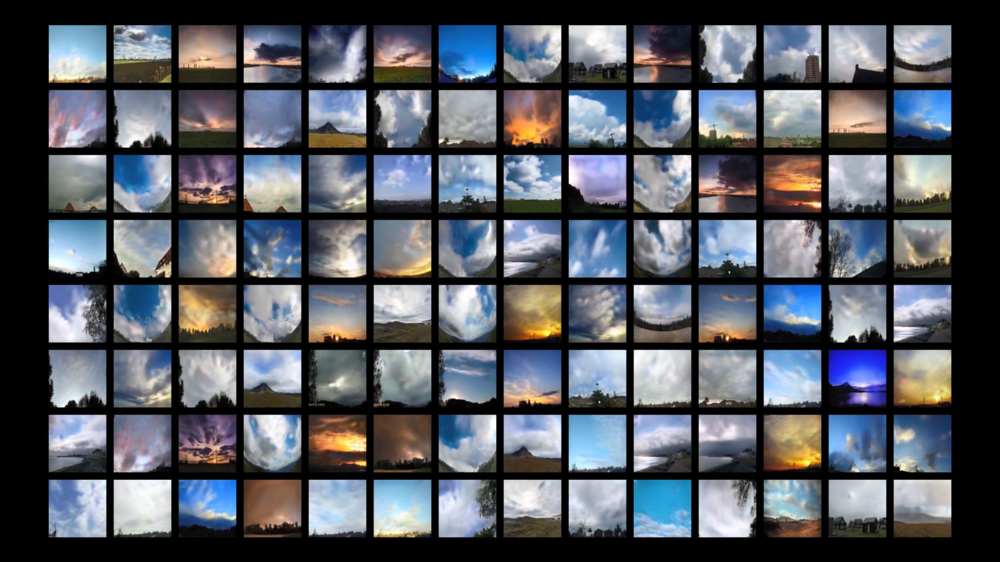

## DTVNet &mdash; Official PyTorch Implementation

  

This repository contains the official pytorch implementation of the below papers:
- [DTVNet: Dynamic Time-lapse Video Generation via Single Still Image, ECCV'20, Spotlight](https://www.ecva.net/papers/eccv_2020/papers_ECCV/papers/123500290.pdf)
- [DTVNet+: A High-Resolution Scenic Dataset for Dynamic Time-lapse Video Generation](https://arxiv.org/pdf/2008.04776.pdf) (A supplemental version that introduces a high-quality scenic dataset.)

## Updates
***12/20/2021***

⭐`News`: We release a high-quality and high-resolution `Quick-Sky-Time (QST)` dataset in the extended [version](https://arxiv.org/pdf/2008.04776.pdf), which can be viewed as a new benchmark for high-quality scenic image and video generation tasks.

https://user-images.githubusercontent.com/26211183/145991500-eb94e352-9175-4063-bbce-ff1f43078040.mp4

## Demo

[](https://www.youtube.com/watch?v=SdZzy42ffEk)

## Using the Code

### Requirements

This code has been developed under `Python3.7`, `PyTorch 1.5.1` and `CUDA 10.1` on `Ubuntu 16.04`. 


```shell
# Install python3 packages
pip3 install -r requirements.txt
```

### Datasets in the paper
- Download [Sky Timeplase](https://drive.google.com/file/d/1xWLiU-MBGN7MrsFHQm4_yXmfHBsMbJQo/view?usp=drive_open) dataset to `data`. You can refer to [MDGAN](https://arxiv.org/pdf/1709.07592.pdf) and corresponding [code](https://github.com/weixiong-ur/mdgan) for more details about the dataset.
- Download `example datasets and checkpoints` from 
[Google Drive](https://drive.google.com/file/d/1Mv3hr5Fkb3L13KP2Oh716x2f0vvLdfLB/view?usp=sharing) 
or 
[Baidu Cloud](https://pan.baidu.com/s/1gj31dZx5tp4s6OzH5K2Tnw) (Key: u6c0).

### Unsupervised Flow Estimation
1. Our another work [ARFlow (CVPR'20)](https://github.com/lliuz/ARFlow) is used as the unsupervised optical flow estimator in the paper. You can refer to `flow/ARFlow/README.md` for more details.

2. Training:

   ```shell
   > Modify `configs/sky.json` if you use another data_root or settings.
   cd flow/ARFlow
   python3 train.py
   ```
   
3. Testing:

    ```shell
    > Pre-traind model is located in `checkpoints/Sky/sky_ckpt.pth.tar`
    python3 inference.py --show  # Test and show a single pair images.
    python3 inference.py --root ../../data/sky_timelapse/ --save_path ../../data/sky_timelapse/flow/  # Generate optical flow in advance for Sky Time-lapse dataset.
    ```

### Running
1. Train `DTVNet` model.

   ```shell
   > Modify `configs/sky_timelapse.json` if you use another data_root or settings.
   python3 train.py
   ```
   
2. Test `DTVNet` model.

   ```shell
   > Pre-traind model is located in `checkpoints/DTV_Sky/200708162546`
   > Results are save in `checkpoints/DTV_Sky/200708162546/results`
   python3 Test.py
   ```

### Quick-Sky-Time (QST) Dataset
QST contains `1,167` video clips that are cut out from `216 time-lapse 4K videos` collected from YouTube, which can be used for a variety of tasks, such as **`(high-resolution) video generation`**, **`(high-resolution) video prediction`**, **`(high-resolution) image generation`**, **`texture generation`**, **`image inpainting`**, **`image/video super-resolution`**, **`image/video colorization`**, **`image/video animating`**, etc. Each short clip contains multiple frames (from a minimum of `58` frames to a maximum of `1,200` frames, a total of `285,446` frames), and the resolution of each frame is more than `1,024 x 1,024`. Specifically, QST consists of a training set (containing `1000` clips, totally `244,930` frames), a validation set (containing `100` clips, totally `23,200` frames), and a testing set (containing `67` clips, totally `17,316` frames). Click [here](https://pan.baidu.com/s/1HUmSu-H1ot39ENeesVuz4Q ) (Key: qst1) to download the QST dataset.

```
# About QST:
├── Quick-Sky-Time
    ├── clips  # contains 1,167 raw video clips
        ├── 00MOhFGvOJs  # [video ID of the raw YouTube video]
            ├── 00MOhFGvOJs 00_00_14-00_00_25.mp4  # [ID] [start time]-[end time] 
            ├── ...
        ├── ...
    ├── train_urls.txt  # index names of the train set
    ├── test_urls.txt  # index names of the test set
    └── val_urls.txt  # index names of the validation set
```

### Citation
If our work is useful for your research, please consider citing:

```shell
@inproceedings{dtvnet,
  title={DTVNet: Dynamic time-lapse video generation via single still image},
  author={Zhang, Jiangning and Xu, Chao and Liu, Liang and Wang, Mengmeng and Wu, Xia and Liu, Yong and Jiang, Yunliang},
  booktitle={European Conference on Computer Vision},
  pages={300--315},
  year={2020},
  organization={Springer}
}
```

```shell
@article{dtvnet+,
  title={DTVNet+: A High-Resolution Scenic Dataset for Dynamic Time-lapse Video Generation},
  author={Zhang, Jiangning and Xu, Chao and Liu, Yong and Jiang, Yunliang},
  journal={arXiv preprint arXiv:2008.04776},
  year={2020}
}
```


